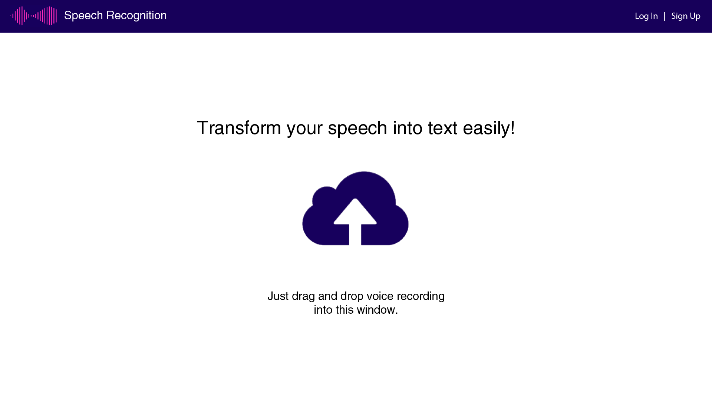
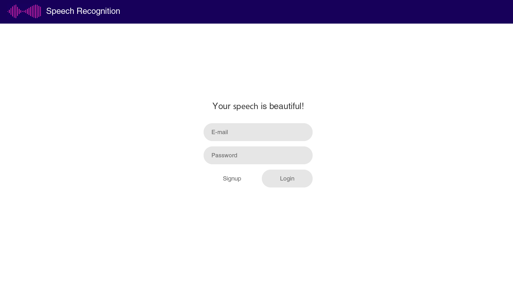
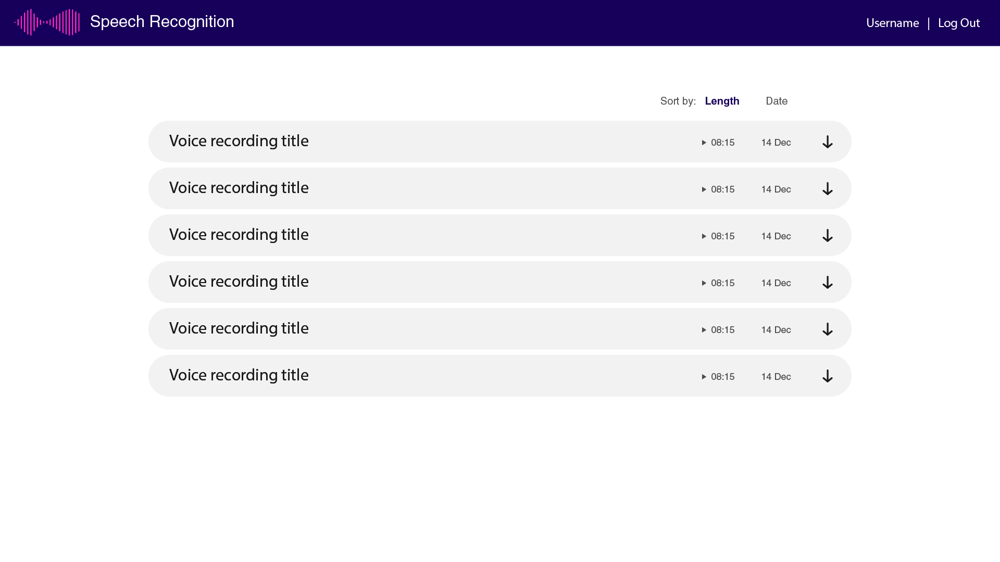
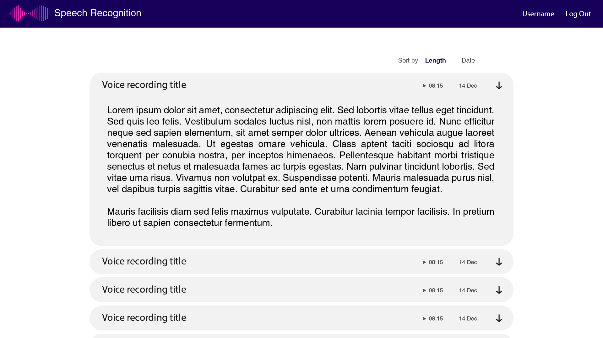

# Speech recognition  [](https://circleci.com/gh/crazymidnight/speech-recognition)

## About
Implementation of multiple voices speech recognition based on deep learning and web technologies.

## Technology stack
1. Frontend: [Vue](https://github.com/vuejs/vue)
2. Backend: [Flask](https://github.com/pallets/flask)
3. Speech recognition: [DeepSpeech](https://arxiv.org/abs/1412.5567) [implementation](https://github.com/mozilla/DeepSpeech) by [Mozilla](https://github.com/mozilla)
4. CI/CD: [CircleCI](https://circleci.com/)
5. Deployment: [Heroku](https://www.heroku.com/)

## Deployment
1. Create virtual environment: ```python3 -m venv venv```
2. Activate virtual environment. Unix-like system: ```source venv/bin/activate```. Windows: ```.\venv\Scripts\activate\```
3. Install dependencies: ```pip install -r requirements.txt```
4. Run application: ```flask run```

## Preview




